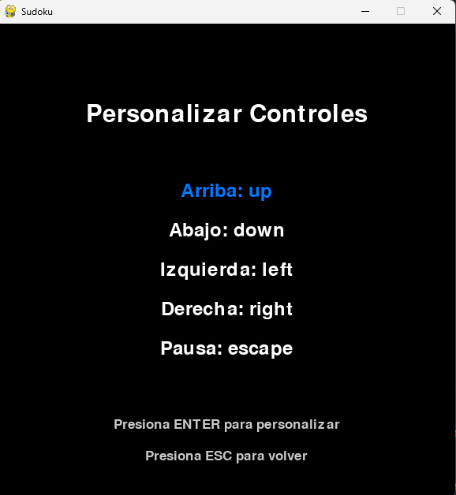
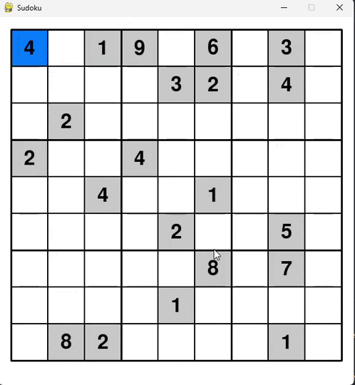

# Sudoku en Python con Pygame

Este proyecto es una implementación del clásico juego Sudoku utilizando Python y la biblioteca Pygame. Ofrece una interfaz gráfica interactiva que permite a los jugadores disfrutar del Sudoku con características adicionales como la personalización de controles.

## Características

- Generación aleatoria de tableros de Sudoku
- Interfaz gráfica intuitiva
- Menú principal con opciones de juego
- Personalización de controles
- Sistema de pausa con opciones para continuar, reiniciar o volver al menú principal
- Verificación automática de victoria

## Capturas

### Menu principal

### Controles

### Menu de pausa

### Juego

## Requisitos

- Python 3.x
- Pygame

## Cómo jugar

1. Ejecuta el script principal:
2. Usa el menú principal para iniciar un nuevo juego o personalizar los controles.
3. En el juego, selecciona las celdas con el ratón o las teclas de dirección.
4. Introduce números del 1 al 9 para llenar las celdas.
5. Usa la tecla de retroceso o suprimir para borrar un número.
6. Completa el tablero siguiendo las reglas del Sudoku.

## Controles predeterminados

- Flechas de dirección: Mover selección
- Números 1-9: Insertar número
- Retroceso/Suprimir: Borrar número
- ESC: Pausar juego
